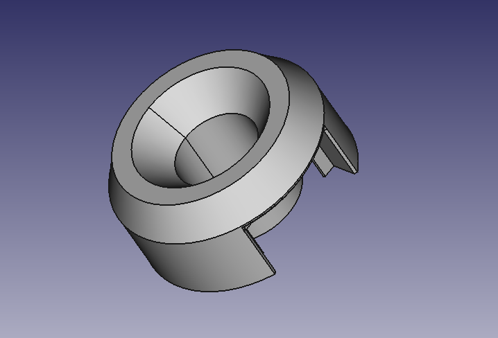
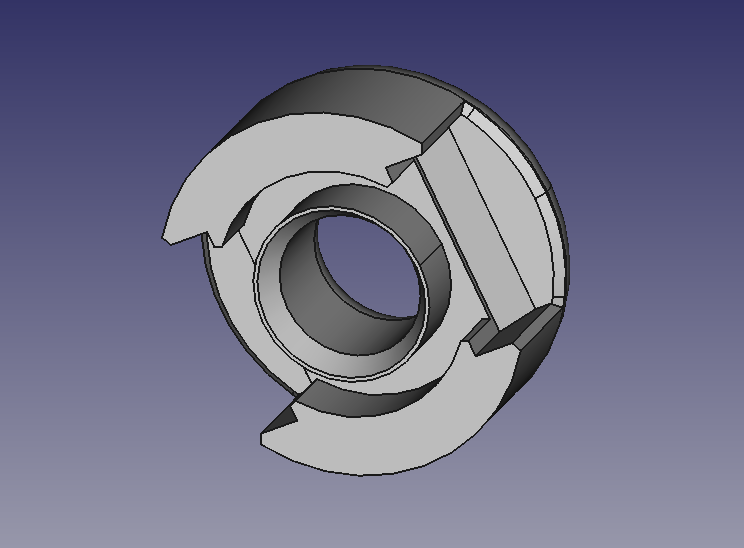
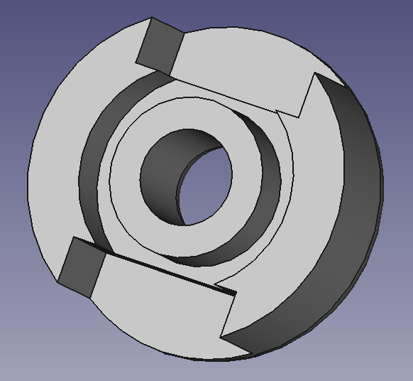
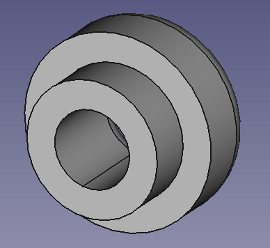

# ledbar-caps
Protective/supporting caps for creating triangle-based structures using our LED bars and rope.

For camp 2023 we wanted to build a structure using LED bars based on pipes we already have and rope running on the inside of the pipes. 3 pipes will be assembled to form  triangle and the triangles will be assembled to create shapes. For this, the ends of the pipes need a proper load bearing area and also some protection for the cables running on the outside. This repo contains 3D printable end caps which will hopefully do that job.

## Design/Test Notes
## 'cap_v3' Design

  - the version we used for CCCamp in the end
  - changed top side from round to 30° edge as else the rope and the round cap create a turning moment that pulls out the caps
  - this fixes that round cap makes rope too far off pivot point, so cap wants to twist out of pipe
  - also makes everything a bit more stable (line load vs. point load)
  - threading rope works OK, a bit fiddly for multi-rope pipes
  - still kind of fiddly to set up with all the rope threading, but worked OK
  - still very sturdy with 60% infill
  - prints completely without supports
## 'cap_v2' Design

  - chamfers make cap nicer and more cable friendly
  - round cap makes rope too far off pivot point, so cap wants to twist out of pipe
  - 'cap' design would probably also have this problem when tested with rope
  - inner diameter looks good
  - chamfer on inner hole makes first layer hard to print and stick for middle portion (single line circle)
  - threading rope seems to work nicely
  - still sturdy middle portion (100% infill)
## 'cap' Design

  - sits well on pipe
  - cable protection ok but, sharp edges should be chamfered
  - needs support, but we might be able to drop this
  - hole in middle needs to be bigger
  - threading rope might be difficult because of edge, might need chamfer on the inside

## 'goldcap' Design

  - currently too small inside plug (radius/diameter mixup by accident)
  - does not really protect cables, needs to be longer
  - prints faster
  - needs support
  - hole in middle needs to be bigger
  - threading rope might be difficult because of edge, might need chamfer on the inside
